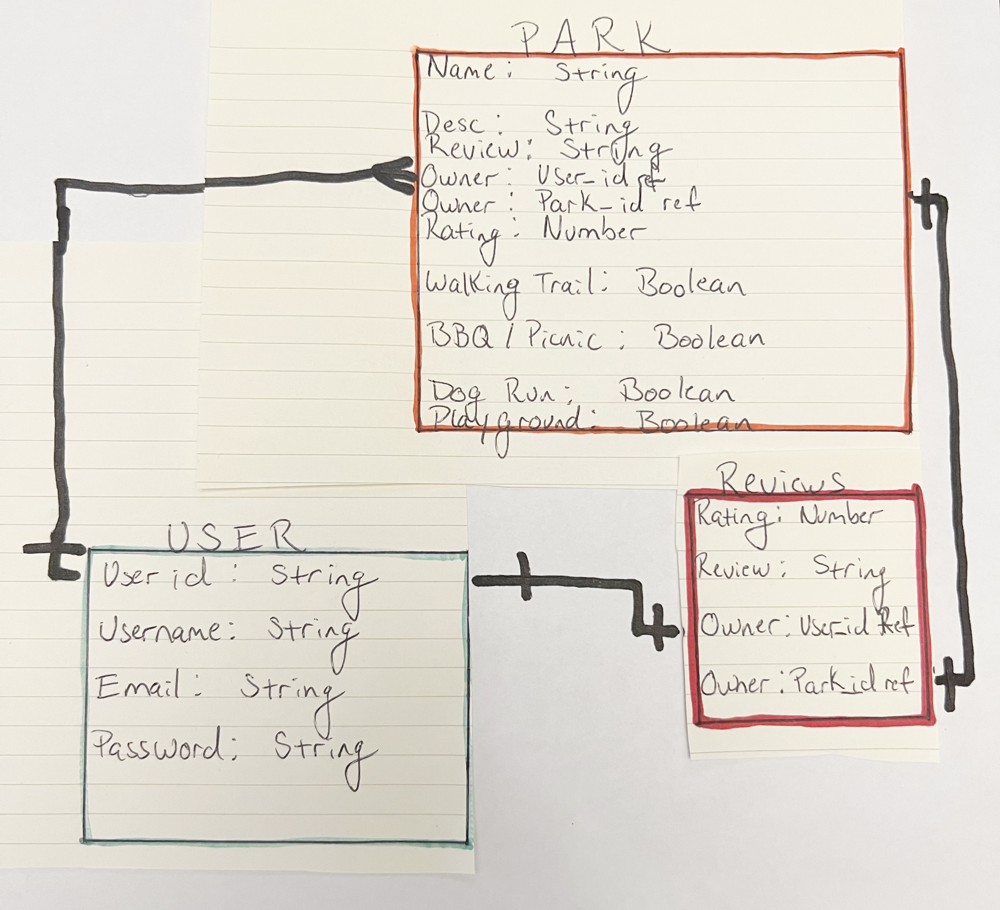

PARKLOPEDIA
Do you love spending a day in the park?  Enjoy Parklopedia, this app allows you to view and comment on parks in your area.  With timestamped user updates you can plan your day better weather your having a picnic, bbg, game of softball or just a good spot to ready with your furry friends.

Technologies used:
HTML
CSS
Javascript
Expresss
MongoDB
Google Oauth
Mongoose
EJS

## User Stories

### Ice Box 

### Current MVP

### Completed
 - As a user I want the ability to log into the app using Oauth authentication so I don't have to create another username and password.

 -As a user I want to rate by number my local parks based on personal experience so others can have a more enjoyable experience.

 -As a user I want the ability to write a written review of my local parks.

 -As a user I want to ability to delete or change my review.

 -As a user I want to see timestamp reviews from other user based most recent park conditions.

 -As a user I want to be able to review specific dog runs in the park.

 -As a user I want to be able to review specific playgrounds in the park.

 -As a user I want to be able to review specific areas of the park if the park is larger then a few blocks.

 -As a user I want to be able to get info on park sculptures and landmakrks.

 -As a user I want to be able to make comments on current landscaping/construction projects going on so other users can plan accordingly.

 -As a user I want to review public restrooms in the park.

 -As a user I want to be able to make time stamped comments on current sport events going on so other users can plan accordingly.

 -As a user I want to be able to make time stamped comments on current bbq facilites being used so other users can plan accordingly.

 -As a user I want to be able to make time stamped comments on current picnic events going on so other users can plan accordingly.

 -As a user I want to be able to make time stamped comments on current ceremonies taking place such as weddings and quinceneras so other users can plan accordingly.

 -As a user I want to be able to make time stamped comments on local vendors locations so other users can plan accordingly.

  -As a user I want to be able to get time stamped notifications about missing pets and children.
 
 ### Wireframes
 
 

 ### Entity Relationship Diagrams
 